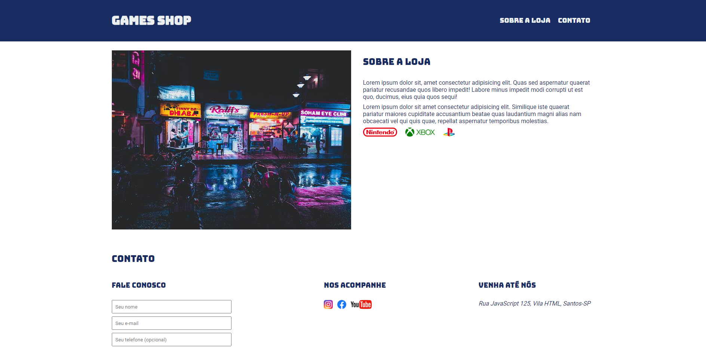

<h1 align="center">
  Arena Santos
</h1>

## 📷 Deploy

<h3>LINK: https://site-games-shop-higorstos.vercel.app/</h3>

## 💻 Projeto

Neste projeto realizado em aula, pratiquei o uso de HTML e CSS para a criação de uma landing page.

## 🚀 Tecnologias

- HTML
- CSS

## 📝 Aprendizados

- [x] Uso de imagens com HTML
- [x] Uso de forms com HTML
- [x] Uso do CSS para estilização da página
